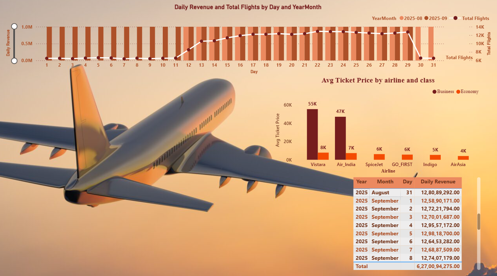
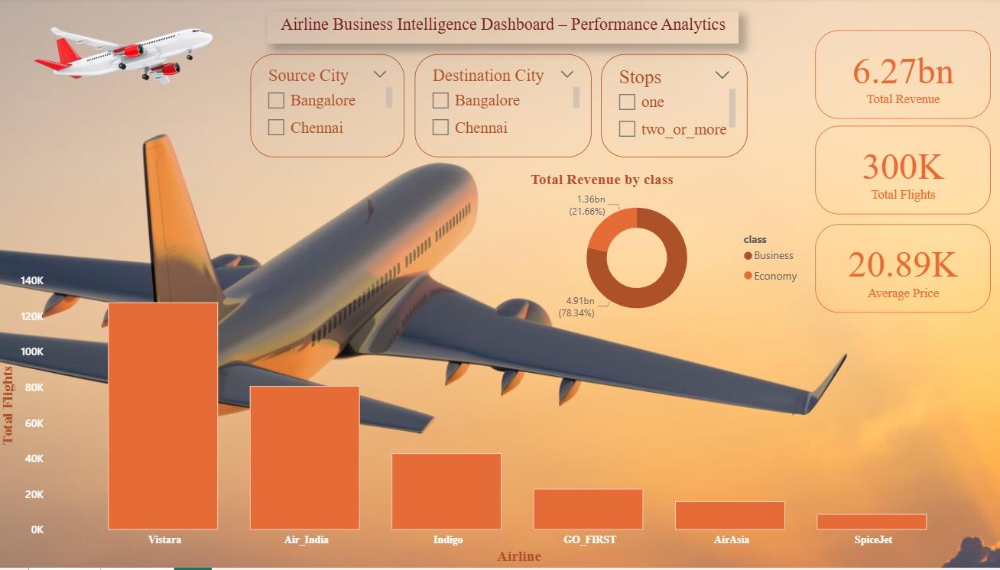

# ✈️ Airline Analytics Dashboard


---

## 📌 Project Overview  
This project analyzes airline flight data and provides **interactive dashboards** to visualize trends, performance, and insights using **Python** and **Power BI**.  

Key outcomes:  
- Data cleaning and preprocessing with Python (Pandas, Jupyter Notebook)  
- Visual analytics with Power BI dashboards  
- Actionable KPIs for airline performance monitoring  

---

## 🛠 Tech Stack  
- **Languages:** Python (Pandas, NumPy)  
- **Visualization:** Power BI  
- **Development Tools:** Jupyter Notebook, Git  
- **Version Control:** GitHub  

---

## 📊 Dashboard Preview  

### Dashboard Page 1  
  

### Dashboard Page 2  
  

---

## 🎥 Dashboard Demo Video  
[Click here to watch the dashboard demo](Dashboard_Demo.mp4)  

---

## 🚀 How to Run the Project  

1. **Clone this repository**  
   ```bash
   git clone https://github.com/VAIBHAVKARALE1011/Airline-Analytics.git
   cd Airline-Analytics
